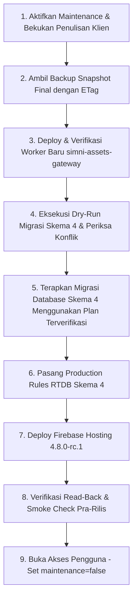

# RUNBOOK DEPLOYMENT & MIGRASI RESMI SIMNI 4.8.0-rc.1

- **Versi Rilis Target:** `4.8.0-rc.1` (Konsisten di seluruh sistem)
- **Status Kesiapan Eksekusi:** **BELUM SIAP DIEKSEKUSI PRODUKSI**
- **Penghalang Wajib Sebelum Eksekusi:**
  1. Pengujian fisik pemindaian QR kamera pada ponsel nyata masih berstatus **BELUM DIUJI** (perangkat fisik terpisah belum diuji secara langsung di lingkungan fisik).
  2. Pembuktian antrean sinkronisasi latar belakang klien (`access-context.js`) secara otomatis penuh belum diuji end-to-end dengan worker.
  3. Konfirmasi dan persetujuan eksplisit pengguna untuk eksekusi mutasi cloud belum diberikan.

---

## 1. Pembekuan Source & Verifikasi Build PWA Final

### A. Catatan Perubahan Kandidat Final (Staging vs 4.7.2 Baseline)
1. **Multi-Role & Access Control (Schema Version 4):**
   - Penambahan role Guru Kelas 1A–6B, Superuser (`ws_kelas3a`), dan VIP (`ws_pjok`).
   - Penolakan CAS multi-role dengan asersi HTTP 412 dinamis pada Worker asli (`edge/worker.js`).
   - Validasi hak tulis pra vs pasca pencabutan (`qa/test-full-integration-pipeline.mjs`).
2. **Penyempurnaan Antarmuka (UI Staging):**
   - Rekap TP: Tabel ringkas 3 kolom, deskripsi tunggal di header, responsif mobile 360×800, edit inline.
   - Peringatan Dini Akademik: Panel tunggal dismissible persisten.
   - Kontras Tombol Unduh Template: Rasio 6.73:1 (WCAG AAA).
   - Identitas Pengaturan: Rendering instan email & UID tanpa placeholder macet.
   - Scanner Presensi: Tombol tutup `×` min 48px di header, kontrol min 48px, label bahasa Indonesia, tema terang/gelap, teardown stream bersih saat ditutup.

### B. Verifikasi Build PWA
- **Direktori Sumber:** `multirole-staging-4.8.0-rc.1/`
- **Perintah Build:**
  ```powershell
  cd "C:\Users\Aretha Hafiza S\Downloads\SIMNI\SIMNI_GADM_INTEGRATION\multirole-staging-4.8.0-rc.1"
  node scripts/build-hosting.mjs
  ```
- **Hasil Verifikasi Build:**
  - **Status:** PASS (111 berkas terverifikasi)
  - **Versi Authority:** `4.8.0-rc.1` (Cocok pada `package.json`, `package-lock.json`, `manifest.json`, `runtime-config.js`, `dashboard.html`, `settings.html`, `index.html`)
  - **Build ID SHA-256:** `f1bbd0dd83dd7f248df018897c3079446b1f3ad0635c60f57e4b67f08586ed3b`
  - **Manifest File:** `public/build-manifest.json`
  - **Target Asset Gateway:** `https://simni-assets-gateway.2ndgoal.workers.dev`

---

## 2. Verifikasi Konfigurasi Produksi, Secret, Binding Worker & Izin Layanan

### A. Metadata & Plain Environment Variables (`edge/wrangler.jsonc`)
- **Nama Worker:** `simni-assets-gateway`
- **Compatibility Date:** `2026-08-27`
- **Compatibility Flags:** `["nodejs_compat"]`
- **Target Workers Dev:** `true` (`https://simni-assets-gateway.2ndgoal.workers.dev`)
- **Plain Vars (Tanpa Kredensial Rahasia):**
  - `FIREBASE_PROJECT_ID`: `admin-kelas-3a`
  - `FIREBASE_DATABASE_URL`: `https://admin-kelas-3a-default-rtdb.asia-southeast1.firebasedatabase.app`
  - `FIREBASE_SERVICE_ACCOUNT_EMAIL`: `firebase-adminsdk-fbsvc@admin-kelas-3a.iam.gserviceaccount.com`
  - `SIMNI_ALLOWED_ORIGINS`: `https://admin-kelas-3a.web.app,https://admin-kelas-3a.firebaseapp.com,https://simni.my.id`
  - `CLOUDINARY_CLOUD_NAME`: `xesssofq`
  - `CLOUDINARY_UPLOAD_PRESET`: `simni_lkpd_dokumen_signed`
- **Rate Limiter Binding:**
  - Nama: `SIMNI_REGISTRATION_LIMITER`
  - Namespace ID: `47201`
  - Batas: 30 request / 60 detik

### B. Secret Worker Wajib (Disimpan di Cloudflare Secrets Vault — Nilai Dirahasiakan)
1. `FIREBASE_PRIVATE_KEY`: Private Key PEM Service Account Google untuk penandatanganan JWT administratif.
2. `CLOUDINARY_API_KEY`: API Key Cloudinary.
3. `CLOUDINARY_API_SECRET`: API Secret Cloudinary untuk validasi dan penandatanganan upload/destroy dokumen.

*Catatan: Nilai rahasia tidak boleh ditulis dalam kode sumber, public hosting, maupun laporan git.*

---

## 3. Strategi Backup, Snapshot & Prosedur Pemulihan Pra-Migrasi

Sebelum melakukan mutasi apa pun pada infrastruktur cloud, lakukan backup komprehensif:

### A. Titik Backup Wajib
1. **Database RTDB Produksi:**
   ```powershell
   # Dijalankan dengan auth token administratif Firebase (bukan client token)
   curl.exe -H "Authorization: Bearer $SIMNI_ADMIN_TOKEN" "https://admin-kelas-3a-default-rtdb.asia-southeast1.firebasedatabase.app/.json?format=export" -o "test-output/backups-pre-4.8.0/production-rtdb-backup-$(Get-Date -Format 'yyyyMMdd-HHmmss').json"
   ```
2. **Rules RTDB Saat Ini:**
   ```powershell
   curl.exe -H "Authorization: Bearer $SIMNI_ADMIN_TOKEN" "https://admin-kelas-3a-default-rtdb.asia-southeast1.firebasedatabase.app/.settings/rules.json" -o "test-output/backups-pre-4.8.0/live-rules-backup-$(Get-Date -Format 'yyyyMMdd-HHmmss').json"
   ```
3. **Versi Worker Cloudflare Sebelumnya:**
   - Catat versi deployment Worker aktif melalui Cloudflare Dashboard / Wrangler Releases.
4. **Hosting Release Aktif:**
   - Identifikasi channel release aktif pada Firebase Hosting `admin-kelas-3a`.

---

## 4. Urutan Cutover Produksi Berdasarkan Dependensi

Urutan cutover dirancang agar tidak ada celah inkonsistensi hak akses ataupun kegagalan skema di tengah jalan. **Hentikan proses seketika jika ada satu langkah yang gagal (Zero-Tolerance Cutover).**



### Tahap 1: Pembekuan Penulisan & Mode Pemeliharaan (Maintenance)
- **Tujuan:** Mencegah perubahan data oleh pengguna lama saat backup dan migrasi berlangsung.
- **Direktori:** `multirole-staging-4.8.0-rc.1/`
- **Tindakan:**
  1. Pasang rules pemeliharaan yang mematikan seluruh write klien (`.write: false` di semua node):
     ```powershell
     firebase deploy --only database --project admin-kelas-3a --config firebase.json
     ```
     *(Menggunakan berkas `firebase/database.rules.multirole-maintenance.json`)*
  2. Set penanda pemeliharaan pada database melalui REST admin:
     ```powershell
     curl.exe -X PATCH -H "Authorization: Bearer $SIMNI_ADMIN_TOKEN" -d '{"multiroleMaintenance": true}' "https://admin-kelas-3a-default-rtdb.asia-southeast1.firebasedatabase.app/meta.json"
     ```
- **Pemeriksaan:** Pastikan aplikasi klien lama menampilkan indikator pemeliharaan atau menolak penulisan data baru.

### Tahap 2: Ambil Snapshot Final Setelah Pembekuan
- **Tindakan:**
  ```powershell
  curl.exe -i -H "Authorization: Bearer $SIMNI_ADMIN_TOKEN" -H "X-Firebase-ETag: true" "https://admin-kelas-3a-default-rtdb.asia-southeast1.firebasedatabase.app/.json" -o "test-output/backups-pre-4.8.0/final-frozen-snapshot.json"
  ```
- **Pemeriksaan:** Catat nilai header `ETag` dan hash SHA-256 dari snapshot final.

### Tahap 3: Siapkan & Verifikasi Worker Baru
- **Direktori:** `multirole-staging-4.8.0-rc.1/edge`
- **Tindakan:**
  ```powershell
  npx wrangler deploy --config wrangler.jsonc
  ```
- **Pemeriksaan:**
  - Endpoint `https://simni-assets-gateway.2ndgoal.workers.dev/` merespons status kesehatan / CORS dengan benar.
  - Rate limiter terpasang tanpa peringatan binding hilang.
  - Secret `FIREBASE_PRIVATE_KEY`, `CLOUDINARY_API_KEY`, dan `CLOUDINARY_API_SECRET` aktif di dashboard Cloudflare.

### Tahap 4: Dry-Run Migrasi Skema 4
- **Direktori:** `multirole-staging-4.8.0-rc.1/`
- **Tindakan:**
  ```powershell
  $env:SIMNI_MIGRATION_DATABASE_URL = "https://admin-kelas-3a-default-rtdb.asia-southeast1.firebasedatabase.app"
  $env:SIMNI_MIGRATION_PROJECT_ID = "admin-kelas-3a"
  $env:SIMNI_MIGRATION_AUTH_TOKEN = $SIMNI_ADMIN_TOKEN
  node scripts/migrate-multirole.mjs --plan multirole-migration-plan.private.json
  ```
- **Pemeriksaan:**
  - Skrip menghasilkan `Plan SHA-256: <HASH>`.
  - Tidak ada galat: identitas owner (`unggaran.sditbm@gmail.com`) dan VIP (`anur.auliya01@gmail.com`) cocok di Firebase Auth.
  - Tidak ada konflik pada workspace `ws_kelas3a` atau pending administrative operations.

### Tahap 5: Eksekusi Migrasi Database (Apply Plan)
- **Direktori:** `multirole-staging-4.8.0-rc.1/`
- **Tindakan:**
  ```powershell
  node scripts/migrate-multirole.mjs --apply --plan multirole-migration-plan.private.json --plan-sha256 <HASH_DARI_TAHAP_4>
  ```
- **Pemeriksaan:**
  - Respon output: `Migrasi terkonfirmasi; legacy dipertahankan. Maintenance tetap aktif sampai cutover selesai.`
  - Struktur `accessControl` memiliki `schemaVersion: 4` dan `maintenance: true`.

### Tahap 6: Pasang Production Rules RTDB Skema 4
- **Tujuan:** Mengaktifkan proteksi multi-role berbasis skema 4.
- **Tindakan:**
  - Ganti referensi rules di `firebase.json` mengarah ke `firebase/database.rules.production.json`.
  - Deploy rules ke project produksi:
    ```powershell
    firebase deploy --only database --project admin-kelas-3a
    ```
- **Pemeriksaan:**
  - CLI melaporkan `Rules updated successfully`.
  - Rules production mensyaratkan `schemaVersion == 4` dan `maintenance != true`.

### Tahap 7: Deploy Firebase Hosting Final (PWA 4.8.0-rc.1)
- **Tujuan:** Memperbarui antarmuka web PWA dengan build ID final `f1bbd0dd...`.
- **Direktori:** `multirole-staging-4.8.0-rc.1/`
- **Tindakan:**
  ```powershell
  firebase deploy --only hosting --project admin-kelas-3a
  ```
- **Pemeriksaan:**
  - Buka `https://admin-kelas-3a.web.app/build-manifest.json` dan pastikan Build ID cocok: `f1bbd0dd83dd7f248df018897c3079446b1f3ad0635c60f57e4b67f08586ed3b`.
  - Service Worker `sw.js` merespons dengan cache header yang benar.

### Tahap 8: Verifikasi Sebelum Akses Pengguna Dibuka
1. Superuser login ke `https://admin-kelas-3a.web.app`.
2. Verifikasi status akun di Pusat Pengaturan: tertera role Superuser, email, dan UID.
3. Verifikasi data siswa, nilai, dan rekap TP di `ws_kelas3a` terbaca lengkap.
4. Verifikasi bahwa penulisan data oleh akun yang belum disetujui ditolak oleh rules.

### Tahap 9: Buka Akses Pengguna (Open Access)
- **Tindakan:**
  ```powershell
  node scripts/migrate-multirole.mjs --open-access --confirm-schema 4
  ```
- **Pemeriksaan:**
  - Respon: `Akses authority dibuka; registrasi tetap mengikuti pengaturan superuser.`
  - `accessControl.maintenance` berubah menjadi `false`.
  - Lakukan smoke-test login guru kelas lain dan verifikasi akses ke ruang kerja masing-masing.

---

## 5. Prosedur Pembatalan & Rollback (Jika Terjadi Kegagalan)

Jika salah satu tahap di atas mengalami kegagalan, **JANGAN MENCOBA MEMBUKA RULES ATAU MEMAKSAKAN PERUBAHAN**. Ikuti prosedur rollback:

1. **Jika Migrasi Database Gagal (HTTP 412 / Hash Mismatch):**
   - Maintenance rules tetap aktif.
   - Database tidak termutasi karena migrasi menerapkan transaksi atomik ETag (`if-match`).
   - Periksa konflik snapshot, ulangi pembuatan plan dry-run.
2. **Jika Perlu Mengembalikan Database ke Baseline Pra-Migrasi:**
   - Pertahankan rules maintenance.
   - Restore snapshot awal:
     ```powershell
     curl.exe -X PUT -H "Authorization: Bearer $SIMNI_ADMIN_TOKEN" --data-binary @"test-output/backups-pre-4.8.0/final-frozen-snapshot.json" "https://admin-kelas-3a-default-rtdb.asia-southeast1.firebasedatabase.app/.json"
     ```
   - Pasang kembali rules versi 4.7.2.
3. **Jika Hosting Baru Bermasalah:**
   - Rollback channel release melalui Firebase Console Hosting ke release 4.7.2 sebelumnya secara instan (Zero-Downtime Rollback).

---

## 6. Persiapan Update APK Android (id.sch.simni.app)

### A. Forensik & Temuan Sertifikat APK 4.7.2 Eksisting
Berdasarkan analisis otoritatif menggunakan `apksigner` dan `aapt2` terhadap berkas `SIMNI_v.4.7.2.apk` yang dibagikan kepada pengguna:
- **Application ID:** `id.sch.simni.app`
- **Version Code Lama:** `40702`
- **Version Name Lama:** `4.7.2`
- **Sertifikat Penandatanganan:**
  - Owner: `C=US, O=Android, CN=Android Debug`
  - SHA-256 Fingerprint: `08:70:EA:9F:2B:52:40:FE:12:56:48:85:90:17:93:8B:70:48:1A:91:B9:78:87:4E:5A:CC:72:E4:6C:4B:36:5E`
  - SHA-1 Fingerprint: `18:CA:9A:30:58:90:61:20:AE:7B:51:33:F6:40:5A:37:69:EE:28:11`
  - Lokasi Keystore Lokal: `C:\Users\Aretha Hafiza S\.android\debug.keystore` (Alias: `androiddebugkey`)

### B. Syarat Kompatibilitas Pembaruan In-Place (Tanpa Data Loss / Uninstall)
- **Wajib Memakai applicationId Sama:** `id.sch.simni.app`
- **Wajib Memakai Sertifikat Sama:** Harus ditandatangani dengan keystore `debug.keystore` yang sama (SHA-256: `08:70:EA:9F...`).
  > *PENTING: Jika menggunakan release keystore baru dengan kunci berbeda, Android Package Manager akan menolak instalasi pembaruan dengan galat `INSTALL_FAILED_UPDATE_INCOMPATIBLE`.*
- **Wajib Memakai Version Code Lebih Tinggi:**
  - `versionCode` kandidat baru: `40800` (terverifikasi `40800 > 40702`)
  - `versionName`: `4.8.0-rc.1`
- **Aset Web Final:** Menggunakan aset dari `multirole-staging-4.8.0-rc.1/public/` yang telah diverifikasi (Build ID `f1bbd0dd...`).

### C. Mekanisme Distribusi & Pembaruan (Klarifikasi Arsitektur)
1. **Tidak Ada Remote URL Loading:**
   Konfigurasi `capacitor.config.json` menggunakan `"webDir": "public"` dan `"server": { "androidScheme": "https", "cleartext": false }`. Aset web dibundel secara lokal di dalam APK (`android/app/src/main/assets/public/`).
2. **Hosting Baru Tidak Memperbarui APK Terpasang:**
   Deploy Firebase Hosting **TIDAK AKAN** memperbarui aplikasi pada ponsel Android pengguna secara otomatis. Pengguna yang membuka APK akan tetap menjalankan kode lokal versi APK tersebut sampai file APK baru dipasang.
3. **Mekanisme Distribusi:**
   Tidak ada integrasi Google Play Store atau layanan OTA in-app updater otomatis. Distribusi dilakukan secara manual (sideload file APK). Pengguna mengunduh berkas APK baru dan memasangnya di atas APK lama. Karena `applicationId`, sertifikat signing, dan `versionCode` konsisten, data lokal tersimpan (IndexedDB/Local Cache) tidak akan terhapus.

### D. Prosedur Build APK Pembaruan (DIPERSIAPKAN — JANGAN DIKOMPILASI DAHULU)
1. Sinkronkan web assets final ke direktori Android Capacitor:
   ```powershell
   npx cap copy android
   ```
2. Pastikan `android/app/build.gradle` terkonfigurasi dengan:
   ```groovy
   defaultConfig {
       applicationId "id.sch.simni.app"
       versionCode 40800
       versionName "4.8.0-rc.1"
   }
   ```
3. Konfigurasi signing release diarahkan ke keystore yang cocok tanpa menampilkan password di file publik.
4. **Kompilasi APK DITUNDA** hingga ada konfirmasi dan instruksi resmi pengguna.

---

## 7. Status Kesiapan Akhir & Checklist Pra-Eksekusi

| Item Verifikasi | Status | Keterangan |
|---|---|---|
| Pengecekan UI Staging (4 Perbaikan Utama) | **LULUS** | 10 tangkapan layar tersimpan di `test-output/ui-patch-check-2026-09-16/` |
| Pengecekan UI Scanner Presensi (5 Poin) | **LULUS (4/4)**<br>**BELUM DIUJI (1/1)** | Poin 1–4 LULUS (10 screenshot). Poin 5 (kamera ponsel fisik) BELUM DIUJI. |
| Pengujian Konkurensi Worker Asli (HTTP 412) | **LULUS** | Asersi dinamis `assert.ok(rtdb412Entries.length > 0)` terbukti di emulator. |
| Pengujian Komparatif Hak Tulis Pencabutan | **LULUS** | HTTP 200 pra-pencabutan vs HTTP 401 pasca-pencabutan terbukti di emulator. |
| Build PWA & Manifest Hash | **LULUS** | Build ID: `f1bbd0dd83dd7f248df018897c3079446b1f3ad0635c60f57e4b67f08586ed3b` |
| Verifikasi Sertifikat Signing APK 4.7.2 | **LULUS** | SHA-256 `08:70:EA:9F...` cocok dengan `debug.keystore` lokal. |
| Antrean Sinkronisasi Klien Otomatis Penuh | **BELUM DIUJI** | Teruji via REST token langsung; background queue klien belum diuji end-to-end. |
| Pengujian Kamera Ponsel Fisik di Dunia Nyata | **BELUM DIUJI** | Perangkat ponsel fisik belum dikoneksikan ke harness pengujian. |
| **Izin Eksekusi Mutasi Produksi** | **MENUNGGU** | Menunggu persetujuan eksplisit dari Pengguna. |
